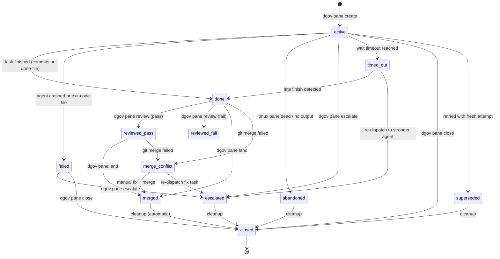

# dgov

A meta harness for AI coding agents.

A test harness runs tests. A meta harness runs the things that write the code. dgov sits above any CLI-based coding agent — Claude Code, Codex, Gemini, Cursor, Copilot, Cline, and others — and manages what they cannot manage about themselves: isolation, lifecycle, and integration.

The problem is simple. AI coding agents edit files. When two agents edit the same repo at the same time, they collide. When an agent runs unsupervised, it stalls at permission prompts, drifts off-task, or silently fails. When it finishes, its changes sit on a branch that nobody reviews. dgov solves each of these problems through one mechanism: git worktrees governed by a uniform lifecycle.
Each agent gets its own worktree. Each worktree gets its own branch. The governor — you, sitting on `main` — dispatches tasks, waits for completion, reviews diffs, and merges results. The agents write code. dgov tracks state, logs events, and attributes every change to the agent that made it.

## Lifecycle

Panes follow a strict state machine enforced by the persistence layer. Transitions are validated to ensure consistency across the worker lifecycle.



## Signal Flow

The Governor and Workers communicate through three primary channels:

1.  **State DB (SQLite):** Authoritative state (active, done, merged) and event journal.
2.  **Filesystem (done signals):** Workers touch `.dgov/done/<slug>` on success or `.dgov/done/<slug>.exit` on failure. These are authoritative signals that override background detection.
3.  **Tmux/Pseudo-terminal:** The governor captures worker output for stabilization detection and can send keystrokes/responses back to the agent via `dgov pane respond`.

Done detection uses a prioritized fallback strategy:
- **Authoritative:** Presence of a `.done` or `.done.exit` file.
- **Inferred:** Git commits on the worker branch (30s grace period).
- **Stabilization:** No output for N seconds (TUI agents).
- **Liveness:** Tmux pane is dead or process is gone.

For API-style agents, the preferred completion path is `dgov worker complete` or
`dgov worker fail` from inside the worker pane rather than relying on
stabilization heuristics.

## Design

- **Lightweight** — pure Python, one dependency (click), no daemon, no server
- **Extensible** — add agents via TOML config, backends via protocol, hooks via shell scripts
- **Developer-friendly** — git worktrees, tmux panes, CLI commands; no new paradigm to learn
- **Composable** — DAGs, missions, and batch specs compose from the same primitives
- **Opinionated where it matters** — governor stays on `main`, workers get worktrees, protected files are restored before merge

## Architecture

Three internal layers carry most of the current policy:

- **Executor pipeline** — `src/dgov/executor.py` owns dispatch preflight, wait/review/merge gates, and cleanup. `pane`, `mission`, `batch`, `dag`, `merge-queue`, and monitor-driven landing call the same lifecycle entrypoints.
- **Context packets** — `src/dgov/context_packet.py` compiles prompt-derived file touches, tests, hints, and commit messages into one packet used by preflight, worker instructions, and worktree setup.
- **Decision providers** — `src/dgov/decision.py` and `src/dgov/decision_providers.py` wrap task routing, monitor classification, and pane review as typed decisions so callers do not need to know which backend transport produced the answer.

Related behavior:

- **Worker completion API** — API-oriented agents finish by calling `dgov worker complete` or `dgov worker fail`, which records pane state and writes the done or exit signal file.
- **Validated merges** — worker branches are merged and checked in a temporary candidate worktree before `main` is advanced.
- **Monitor** — `dgov monitor` persists status under `.dgov/monitor/`, watches the event journal, and can auto-complete, auto-land, or retry panes based on output and commit state.

## Install

```bash
uv tool install dgov
```

Requires: Python 3.12+, git, tmux.

## Quick start

Run `dgov` with no arguments to launch the governor workspace:

```bash
dgov                          # launches dashboard + lazygit in tmux
dgov --governor gemini        # override governor agent
```

Or dispatch a worker directly:

```bash
dgov pane create -a claude -p "Add retry logic to the HTTP client"
dgov pane wait <slug>
dgov pane review <slug>
dgov pane land <slug>          # review + merge + close
```

State and events live in `.dgov/state.db` (SQLite, WAL mode).

## Commands

### Core

| Command | Description |
|---------|-------------|
| `dgov status` | Show session state and pane health |
| `dgov agents` | List all registered agents and install status |
| `dgov dashboard` | Live TUI showing pane status, events, and metrics |
| `dgov dashboard --pane` | Launch dashboard in a tmux split pane |

### Pane lifecycle

| Command | Description |
|---------|-------------|
| `dgov pane create` | Create a worker pane (worktree + tmux + agent) |
| `dgov pane util` | Run a command in a utility pane (no worktree) |
| `dgov pane list` | List all panes with state, agent, duration |
| `dgov pane wait` | Block until one or more panes finish |
| `dgov pane wait-all` | Block until all active panes finish |
| `dgov pane review` | Inspect a pane's diff, commit count, and verdict |
| `dgov pane land` | Review + merge + close in one step |
| `dgov pane merge-all` | Merge all done panes sequentially |
| `dgov pane land-all` | Review + merge + close all done panes sequentially |
| `dgov pane close` | Close a pane and clean up worktree (idempotent) |
| `dgov pane resume` | Re-launch agent in existing worktree |
| `dgov pane retry` | Fresh attempt with new worktree |
| `dgov pane retry-or-escalate` | Retry with auto-escalation policy |
| `dgov pane escalate` | Re-dispatch to a stronger agent |
| `dgov pane classify` | Recommend an agent for a task |
| `dgov pane output` | Clean ANSI-stripped log text |
| `dgov pane capture` | Live tmux pane capture |
| `dgov pane logs` | Raw persistent log (survives pane death) |
| `dgov pane diff` | Raw diff for inspection |
| `dgov pane message` | Send text to a running worker |
| `dgov pane respond` | Reply to an agent's prompt |
| `dgov pane nudge` | Prod a stalled agent |
| `dgov pane signal` | Manually signal a pane as done or failed |
| `dgov pane prune` | Clean up stale pane records |
| `dgov pane merge-request` | Enqueue a merge (used by LT-GOVs) |

### DAG runner

Run multi-task workflows defined in TOML. Tasks declare dependencies and file
touches; dgov persists run state in SQLite and schedules work from dependency
readiness plus file claims.

```bash
dgov dag run TASKS.toml                    # execute all tiers
dgov dag run TASKS.toml --dry-run          # show tier plan without executing
dgov dag run TASKS.toml --tier 0           # execute only tier 0
dgov dag run TASKS.toml --skip slow-task   # skip a task and its dependents
dgov dag run TASKS.toml --no-auto-merge    # hold merges for manual review
dgov dag resume TASKS.toml                 # resume the most recent failed/partial run
dgov dag status TASKS.toml                 # inspect persisted DAG task state
dgov dag merge TASKS.toml                  # merge held tasks from a prior run
```

Features: retry with augmented prompts on failure, agent escalation chains,
per-agent concurrency limits, crash-safe resume via `dag_runs` and `dag_tasks`,
and `commit_message` from TOML used as the merge commit message.

### Orchestration

| Command | Description |
|---------|-------------|
| `dgov mission` | Single-prompt orchestration: dispatch, wait, review, merge |
| `dgov batch` | Execute a batch spec with DAG-ordered parallelism |
| `dgov monitor` | Run the worker monitor daemon or launch it in a utility pane |
| `dgov review-fix` | Review-then-fix pipeline with severity filtering |

### LT-GOV (delegation)

A lieutenant governor is a sub-governor worker that follows the canonical governor pipeline (preflight → dispatch → wait → review → merge → cleanup). The governor delegates a broad task to an LT-GOV, which runs workers via `dgov pane create --land`, tracks progress in `.dgov/progress/{ltgov_slug}.json`, and escalates structural issues back to the governor instead of editing code directly.

```bash
dgov pane create -a claude -T lt-gov -V task_list="..." # dispatch LT-GOV
dgov dashboard                                            # monitor worker progress
```

| Command | Description |
|---------|-------------|
| `dgov pane merge-request` | Enqueue a merge for governor processing |
| `dgov merge-queue list` | Show pending merge requests |
| `dgov merge-queue process` | Claim and execute next merge |

### Tools

| Command | Description |
|---------|-------------|
| `dgov blame <file>` | Show which agent/pane last touched a file |
| `dgov openrouter models` | List available models on OpenRouter |
| `dgov openrouter status` | Show API key status, default model, connectivity |
| `dgov openrouter test` | Send a test prompt via OpenRouter |
| `dgov template list` | List all prompt templates |
| `dgov template create` | Create a new template |
| `dgov template show` | Show template details and required variables |
| `dgov checkpoint create` | Create a named checkpoint |
| `dgov checkpoint list` | List all checkpoints |

## Built-in agents

| Agent | CLI | Done detection |
|-------|-----|----------------|
| `claude` | Claude Code | api |
| `codex` | Codex CLI | api |
| `gemini` | Gemini CLI | api |
| `cursor` | Cursor CLI | api |
| `opencode` | OpenCode | api |
| `cline` | Cline CLI | stable |
| `qwen` | Qwen CLI | api |
| `amp` | Amp CLI | api |
| `pi` | pi CLI | api |
| `copilot` | Copilot CLI | api |
| `crush` | Crush CLI | stable |

User agents: `~/.dgov/agents.toml` (global) or `.dgov/agents.toml` (per-project). See `dgov agents` for what's installed.

Done strategies: `api` (agent reports completion through `dgov worker complete`
or `dgov worker fail`), `exit` (process exits), `commit` (watches for git
commits), `stable` (output stabilization), `signal` (done file touched).

## Hooks

Shell scripts that run at lifecycle events. Three levels of precedence:

1. `.dgov/hooks/` — per-repo (highest priority)
2. `.dgov-hooks/` — team/shared (checked into repo)
3. `~/.dgov/hooks/` — global (lowest priority)

| Hook | When |
|------|------|
| `worktree_created` | After worktree + branch are set up, before agent launches |
| `pre_merge` | Before merging a worker's branch (restore protected files) |
| `post_merge` | After merge (lint changed files, verify protected files) |
| `before_worktree_remove` | Before deleting a worktree (archive artifacts) |

## Configuration

- `.dgov/config.toml` — per-repo settings (`governor_agent`, `governor_permissions`)
- `.dgov/agents.toml` — custom agent definitions (commands, env, done strategy)
- `.dgov/templates/` — prompt templates with variable substitution
- `.dgov/state.db` — SQLite state and events (auto-created, WAL mode)
- `~/.dgov/config.toml` — global settings (OpenRouter API key, defaults)
- `~/.dgov/agents.toml` — global custom agents

## License

MIT
