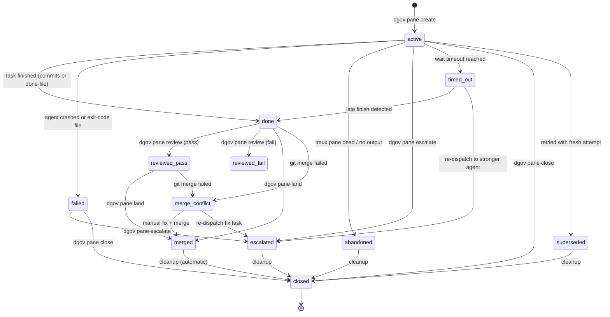

# dgov

A meta harness for AI coding agents.

A test harness runs tests. A meta harness runs the things that write the code. dgov sits above any CLI-based coding agent — Claude Code, Codex, Gemini, Cursor, Copilot, Cline, and others — and manages what they cannot manage about themselves: isolation, lifecycle, and integration.

The problem is simple. AI coding agents edit files. When two agents edit the same repo at the same time, they collide. When an agent runs unsupervised, it stalls at permission prompts, drifts off-task, or silently fails. When it finishes, its changes sit on a branch that nobody reviews. dgov solves each of these problems through one mechanism: git worktrees governed by a uniform lifecycle.
Each agent gets its own worktree. Each worktree gets its own branch. The governor — you, sitting on `main` — dispatches tasks, waits for completion, reviews diffs, and merges results. The agents write code. dgov tracks state, logs events, and attributes every change to the agent that made it.

## Lifecycle

Panes follow a strict state machine enforced by the persistence layer. Transitions are validated to ensure consistency across the worker lifecycle.



## Signal Flow

The Governor and Workers communicate through three primary channels:

1.  **State DB (SQLite):** Authoritative state (active, done, merged) and event journal.
2.  **Filesystem (done signals):** Workers touch `.dgov/done/<slug>` on success or `.dgov/done/<slug>.exit` on failure. These are authoritative signals that override background detection.
3.  **Tmux/Pseudo-terminal:** The governor captures worker output for stabilization detection and can send keystrokes/responses back to the agent via `dgov pane respond`.

Done detection uses a prioritized fallback strategy:
- **Authoritative:** Presence of a `.done` or `.done.exit` file.
- **Inferred:** Git commits on the worker branch (30s grace period).
- **Stabilization:** No output for N seconds (TUI agents).
- **Liveness:** Tmux pane is dead or process is gone.

For API-style agents, the preferred completion path is `dgov worker complete` or
`dgov worker fail` from inside the worker pane rather than relying on
stabilization heuristics.

## Design

- **Lightweight** — pure Python, one dependency (click), no daemon, no server
- **Eval-first planning** — falsifiable statements and invariants before task derivation
- **Decision providers** — typed requests for routing, monitor, and review across heterogeneous backends
- **Typed event journal** — SQLite-backed stream of all lifecycle transitions and decisions
- **Extensible** — add agents via TOML config, backends via protocol, hooks via shell scripts
- **Developer-friendly** — git worktrees, tmux panes, CLI commands; no new paradigm to learn
- **Composable** — DAGs, missions, and plans compose from the same primitives
- **Opinionated where it matters** — governor stays on `main`, workers get worktrees, protected files are restored before merge

## Architecture

Five internal layers carry the current policy:

- **Deterministic Kernel** — `src/dgov/kernel.py` owns the state machine logic for panes and DAGs. It is I/O-free and purely functional.
- **Plan System** — `src/dgov/plan.py` handles eval-first plan schema, validation, and compilation into executable DAGs.
- **Executor Pipeline** — `src/dgov/executor.py` owns the side-effecting lifecycle: dispatch preflight, wait/review/merge gates, and cleanup.
- **Agent Router** — `src/dgov/router.py` resolves logical model names to physical backends with circuit-breaker and fallback support.
- **Observability (Spans)** — `src/dgov/spans.py` provides structured tool-trace and span logging for performance analysis and training export.

Related behavior:

- **Context packets** — `src/dgov/context_packet.py` compiles prompt-derived file touches, tests, and hints into one packet used by preflight and worker instructions.
- **Worker completion API** — API-oriented agents finish by calling `dgov worker complete` or `dgov worker fail`.
- **Monitor** — `dgov monitor` watches the event journal to auto-complete, auto-land, or retry panes based on output and commit state.

## Install

```bash
uv tool install dgov
```

Requires: Python 3.12+, git, tmux.

## Quick start

Run `dgov` with no arguments to launch the governor workspace:

```bash
dgov                          # launches dashboard + lazygit in tmux
dgov --governor gemini        # override governor agent
```

Or dispatch a worker directly:

```bash
dgov pane create -a claude -p "Add retry logic to the HTTP client"
dgov pane wait <slug>
dgov pane review <slug>
dgov pane land <slug>          # review + merge + close
```

State and events live in `.dgov/state.db` (SQLite, WAL mode).

## Commands

### Core

| Command | Description |
|---------|-------------|
| `dgov status` | Show session state and pane health |
| `dgov agent list` | List all registered agents and install status |
| `dgov agent stats` | Aggregate agent performance metrics |
| `dgov dashboard` | Live TUI showing pane status, events, and metrics |
| `dgov dashboard --pane` | Launch dashboard in a tmux split pane |
| `dgov codebase` | Generate or show the codebase module map |

### Pane lifecycle

| Command | Description |
|---------|-------------|
| `dgov pane create` | Create a worker pane (worktree + tmux + agent) |
| `dgov pane list` | List all panes with state, agent, duration |
| `dgov pane wait` | Block until one or more panes finish |
| `dgov pane wait-any` | Block until at least one active pane finishes |
| `dgov pane review` | Inspect a pane's diff, commit count, and verdict |
| `dgov pane land` | Review + merge + close in one step |
| `dgov pane close` | Close a pane and clean up worktree (idempotent) |
| `dgov pane resume` | Re-launch agent in existing worktree |
| `dgov pane retry` | Fresh attempt with new worktree |
| `dgov pane escalate` | Re-dispatch to a stronger agent |
| `dgov pane output` | Clean ANSI-stripped log text |
| `dgov pane diff` | Raw diff for inspection |
| `dgov pane message` | Send text to a running worker |
| `dgov pane signal` | Manually signal a pane as done or failed |
| `dgov pane blame` | Show which agent/pane last touched a file |

### Plan & DAG

Plans are the primary dispatch surface for multi-step work. They are eval-first and compile into DAGs.

| Command | Description |
|---------|-------------|
| `dgov plan scratch` | Create a scratch plan under `.dgov/plans/` |
| `dgov plan validate` | Validate plan TOML schema and invariants |
| `dgov plan compile` | Show the tier view of a compiled plan |
| `dgov plan run` | Execute a plan through the DAG kernel |
| `dgov plan scaffold` | Generate a plan from goal and file list |
| `dgov plan verify` | Run falsifiable eval evidence commands |
| `dgov plan resume` | Resume a failed or partial plan run |
| `dgov plan cancel` | Cancel an open plan run and close panes |
| `dgov dag run` | Execute a raw DAG task file |
| `dgov dag status` | Inspect persisted DAG task state |

### Orchestration & Observability

| Command | Description |
|---------|-------------|
| `dgov monitor` | Run the worker monitor daemon (auto-remediation) |
| `dgov ledger list` | Query the operational ledger (bugs, rules, debt) |
| `dgov ledger add` | Add a new entry to the operational ledger |
| `dgov ledger resolve` | Resolve a ledger entry (mark fixed/accepted) |
| `dgov trace show` | Show spans and tool trace summary for a pane |
| `dgov trace stats` | Aggregate span and tool-use metrics |
| `dgov trace training` | Export trajectory JSONL for model fine-tuning |
| `dgov review-fix` | Run the review-then-fix pipeline |
| `dgov wait` | Block on governor interrupts or DAG completion |

### Worker API (internal)

Called by agents inside worker panes.

| Command | Description |
|---------|-------------|
| `dgov worker complete` | Auto-commit and signal success |
| `dgov worker fail` | Signal failure with reason |
| `dgov worker checkpoint` | Record a progress checkpoint |

## Built-in agents

| Agent | CLI | Done detection |
|-------|-----|----------------|
| `claude` | Claude Code | api |
| `codex` | Codex CLI | api |
| `gemini` | Gemini CLI | api |
| `cursor` | Cursor CLI | api |
| `opencode` | OpenCode | api |
| `cline` | Cline CLI | stable |
| `qwen` | Qwen CLI | api |
| `amp` | Amp CLI | api |
| `pi` | pi CLI | api |
| `copilot` | Copilot CLI | api |
| `crush` | Crush CLI | stable |

User agents: `~/.dgov/agents.toml` (global) or `.dgov/agents.toml` (per-project). See `dgov agents` for what's installed.

Done strategies: `api` (agent reports completion through `dgov worker complete`
or `dgov worker fail`), `exit` (process exits), `commit` (watches for git
commits), `stable` (output stabilization), `signal` (done file touched).

## Hooks

Shell scripts that run at lifecycle events. Three levels of precedence:

1. `.dgov/hooks/` — per-repo (highest priority)
2. `.dgov-hooks/` — team/shared (checked into repo)
3. `~/.dgov/hooks/` — global (lowest priority)

| Hook | When |
|------|------|
| `worktree_created` | After worktree + branch are set up, before agent launches |
| `pre_merge` | Before merging a worker's branch (restore protected files) |
| `post_merge` | After merge (lint changed files, verify protected files) |
| `before_worktree_remove` | Before deleting a worktree (archive artifacts) |

## Configuration

- `.dgov/config.toml` — per-repo settings (`governor_agent`, `governor_permissions`)
- `.dgov/agents.toml` — custom agent definitions (commands, env, done strategy)
- `.dgov/templates/` — prompt templates with variable substitution
- `.dgov/state.db` — SQLite state and events (auto-created, WAL mode)
- `~/.dgov/config.toml` — global settings (OpenRouter API key, defaults)
- `~/.dgov/agents.toml` — global custom agents

## License

MIT
