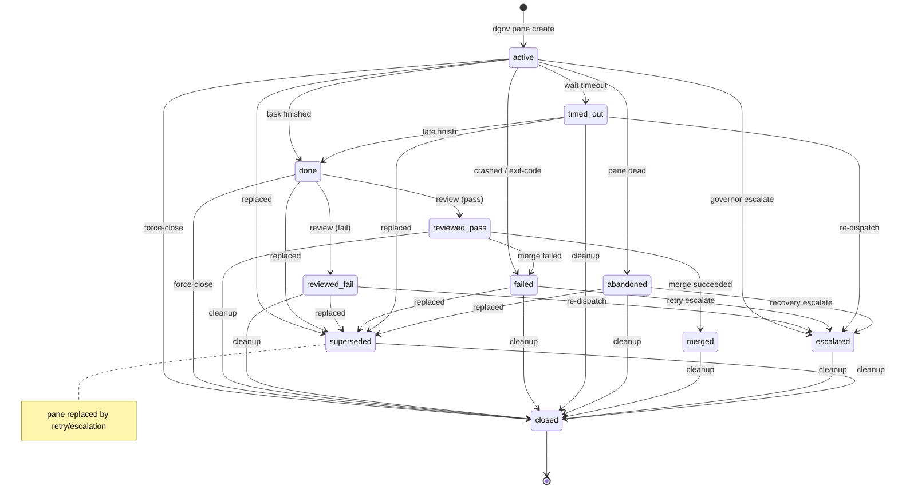

# dgov

A meta harness for AI coding agents.

A test harness runs tests. A meta harness runs the things that write the code. dgov sits above any CLI-based coding agent — Claude Code, Codex, Gemini, Cursor, Copilot, Cline, and others — and manages what they cannot manage about themselves: isolation, lifecycle, and integration.

The problem is simple. AI coding agents edit files. When two agents edit the same repo at the same time, they collide. When an agent runs unsupervised, it stalls at permission prompts, drifts off-task, or silently fails. When it finishes, its changes sit on a branch that nobody reviews. dgov solves each of these problems through one mechanism: git worktrees governed by a uniform lifecycle.
Each agent gets its own worktree. Each worktree gets its own branch. The governor — you, sitting on `main` — dispatches tasks, waits for completion, reviews diffs, and merges results. The agents write code. dgov tracks state, logs events, and attributes every change to the agent that made it.

## Lifecycle

Panes follow a strict state machine enforced by the persistence layer. Transitions are validated to ensure consistency across the worker lifecycle.



Review is mandatory — no direct `done → merged`. Merge failures go to `failed`, not a separate state. Any non-terminal state can reach `closed` directly (governor force-close) or `superseded` (replaced by retry/escalation). The full transition table (11 states, all legal edges) is enforced in [`src/dgov/persistence.py`](src/dgov/persistence.py).

## Signal Flow

The Governor and Workers communicate through three primary channels:

1.  **State DB (SQLite):** Authoritative state (active, done, merged) and event journal.
2.  **Filesystem (done signals):** Workers touch `.dgov/done/<slug>` on success or `.dgov/done/<slug>.exit` on failure. These are authoritative signals that override background detection.
3.  **Tmux/Pseudo-terminal:** The governor captures worker output for stabilization detection and can send text back to a running worker via `dgov pane message`.

Done detection uses a prioritized fallback strategy:
- **Authoritative:** Presence of a `.done` or `.done.exit` file.
- **Inferred:** Git commits on the worker branch (30s grace period).
- **Stabilization:** No output for N seconds (TUI agents).
- **Liveness:** Tmux pane is dead or process is gone.

For API-style agents, the preferred completion path is `dgov worker complete` or
`dgov worker fail` from inside the worker pane rather than relying on
stabilization heuristics.

## Design

- **Lightweight** — pure Python, four dependencies (click, rich, Pillow, tomli_w), no server
- **Eval-first planning** — falsifiable statements and invariants before task derivation
- **Decision providers** — typed requests for routing, monitor, and review across heterogeneous backends
- **Deterministic kernel** — pure state machine drives all lifecycle transitions; I/O-free
- **Typed event journal** — SQLite-backed stream of all lifecycle transitions and decisions
- **Extensible** — add agents via TOML config, backends via protocol, hooks via shell scripts
- **Developer-friendly** — git worktrees, tmux panes, CLI commands; no new paradigm to learn
- **Composable** — DAGs, missions, and plans compose from the same primitives
- **Opinionated where it matters** — governor stays on `main`, workers get worktrees, protected files are restored before merge

## Architecture

Five internal layers carry the current policy:

- **Deterministic Kernel** — `src/dgov/kernel.py` owns the state machine logic for panes and DAGs. It is I/O-free and purely functional.
- **Plan System** — `src/dgov/plan.py` handles eval-first plan schema, validation, and compilation into executable DAGs.
- **Executor Pipeline** — `src/dgov/executor.py` owns the side-effecting lifecycle: dispatch preflight, wait/review/merge gates, and cleanup.
- **Agent Router** — `src/dgov/router.py` resolves roles to physical backends with circuit-breaker and fallback support.
- **Observability (Spans)** — `src/dgov/spans.py` provides structured tool-trace and span logging for performance analysis and training export.

Related behavior:

- **Context packets** — `src/dgov/context_packet.py` compiles prompt-derived file touches, tests, and hints into one packet used by preflight and worker instructions.
- **Worker completion API** — API-oriented agents finish by calling `dgov worker complete` or `dgov worker fail`.
- **Monitor** — `dgov monitor` watches the event journal to auto-complete, auto-merge, or retry panes based on output and commit state.

## Install

```bash
uv tool install dgov
```

Requires: Python 3.12+, git, tmux. At least one CLI-based coding agent (Claude Code, Codex, Gemini, etc.) must be installed and on `$PATH`.

## Quick start

```bash
dgov init                     # scaffold .dgov/ in your repo
dgov                          # launch governor workspace (dashboard + lazygit in tmux)
dgov --governor gemini        # override governor agent
```

Dispatch a single worker:

```bash
dgov pane create -a claude -s fix-parser -r . -p "Fix the CSV parser edge case"
dgov pane land fix-parser      # review + merge + close
```

Multi-step work via plans:

```bash
dgov plan scaffold -g "Add retry logic" -f src/client.py -f tests/test_client.py
dgov plan run .dgov/plans/add-retry-logic.toml
```

State and events live in `.dgov/state.db` (SQLite, WAL mode).

## Commands

### Core

| Command | Description |
|---------|-------------|
| `dgov` | Launch the governor workspace (dashboard + lazygit in tmux) |
| `dgov status` | Show session state, pane health, and agent counts |
| `dgov init` | Initialize a new dgov project (scaffold `.dgov/`) |
| `dgov doctor` | Run diagnostics on the dgov environment |
| `dgov dashboard` | Live TUI showing pane status, events, and metrics |
| `dgov codebase` | Generate or show the codebase module map |
| `dgov resume` | Resume an existing governor session |
| `dgov gc` | Garbage-collect stale tmux sessions, worktrees, and branches |
| `dgov version` | Show dgov version |

### Agent management

| Command | Description |
|---------|-------------|
| `dgov agent list` | List all registered agents and install status |
| `dgov agent stats` | Aggregate agent performance metrics |

### Pane lifecycle

| Command | Description |
|---------|-------------|
| `dgov pane create` | Create a worker pane (worktree + tmux + agent) |
| `dgov pane list` | List all panes with state, agent, duration |
| `dgov pane wait` | Block until one or more panes finish |
| `dgov pane wait-any` | Block until at least one active pane finishes |
| `dgov pane review` | Inspect a pane's diff, commit count, and verdict |
| `dgov pane land` | Review + merge + close in one step |
| `dgov pane merge` | Merge a branch into main with conflict resolution |
| `dgov pane close` | Close a pane and clean up worktree (idempotent) |
| `dgov pane resume` | Re-launch agent in existing worktree |
| `dgov pane retry` | Fresh attempt with new worktree |
| `dgov pane retry-or-escalate` | Retry with auto-escalation after N failures |
| `dgov pane escalate` | Re-dispatch to a stronger agent |
| `dgov pane output` | Clean ANSI-stripped log text |
| `dgov pane tail` | Stream worker output in real-time |
| `dgov pane diff` | Raw diff for inspection |
| `dgov pane message` | Send text to a running worker |
| `dgov pane signal` | Manually signal a pane as done or failed |
| `dgov pane blame` | Show which agent/pane last touched a file |
| `dgov pane transcript` | View a worker session transcript |
| `dgov pane preflight` | Run pre-flight checks before dispatch |
| `dgov pane recover` | Recover pane states from event log after crash |
| `dgov pane merge-request` | Submit a merge request to the queue (used by LT-GOVs) |
| `dgov pane batch` | Dispatch multiple workers from a TOML file |
| `dgov pane gc` | Prune stale entries and clean old worktrees |
| `dgov pane util` | Run a command in a utility pane (no worktree) |

### Plan & DAG

Plans are the primary dispatch surface for multi-step work. They are eval-first and compile into DAGs.

| Command | Description |
|---------|-------------|
| `dgov plan scratch` | Create a scratch plan under `.dgov/plans/` |
| `dgov plan scaffold` | Generate a plan from goal and file list |
| `dgov plan validate` | Validate plan TOML schema and invariants |
| `dgov plan compile` | Show the tier view of a compiled plan |
| `dgov plan run` | Execute a plan through the DAG kernel |
| `dgov plan verify` | Run falsifiable eval evidence commands |
| `dgov plan resume` | Resume a failed or partial plan run |
| `dgov plan cancel` | Cancel an open plan run and close panes |
| `dgov dag run` | Execute a raw DAG task file |
| `dgov dag status` | Inspect persisted DAG task state and eval results |
| `dgov dag wait` | Block until a DAG run completes or fails |
| `dgov dag resume` | Resume a failed DAG run |
| `dgov dag cancel` | Cancel a DAG run and close its panes |
| `dgov dag merge` | Merge an awaiting_merge DAG in topological order |
| `dgov dag skip-task` | Skip a single task and let the kernel advance |
| `dgov dag force-complete` | Force-complete a DAG run (all pending tasks marked done) |

### Orchestration & Observability

| Command | Description |
|---------|-------------|
| `dgov monitor` | Run the worker monitor daemon (auto-remediation) |
| `dgov wait` | Block on governor interrupts or DAG completion |
| `dgov review-fix` | Run the review-then-fix pipeline |
| `dgov merge-queue list` | List merge queue entries |
| `dgov merge-queue process` | Claim and execute the next pending merge |
| `dgov checkpoint create` | Create a named checkpoint of current state |
| `dgov checkpoint list` | List all checkpoints |
| `dgov rebase` | Rebase the governor worktree onto its base branch |
| `dgov batch` | Execute a batch spec with DAG-ordered dispatch |

### Ledger

| Command | Description |
|---------|-------------|
| `dgov ledger list` | Query the operational ledger (bugs, rules, debt, decisions) |
| `dgov ledger add` | Add a new entry to the operational ledger |
| `dgov ledger resolve` | Resolve a ledger entry (mark fixed/accepted) |

### Tracing & Training

| Command | Description |
|---------|-------------|
| `dgov trace show` | Show spans and tool trace summary for a pane |
| `dgov trace stats` | Aggregate span and tool-use metrics |
| `dgov trace export` | Export trajectory JSON for a pane |
| `dgov trace ingest` | Manually ingest a transcript for a pane |
| `dgov trace training` | Export trajectory JSONL for model fine-tuning |

### Decision system

| Command | Description |
|---------|-------------|
| `dgov journal` | Query the decision journal |
| `dgov openrouter status` | Show API key status and connectivity |
| `dgov openrouter models` | List available models on OpenRouter |
| `dgov openrouter test` | Send a test prompt |

### Configuration

| Command | Description |
|---------|-------------|
| `dgov config show` | Print effective configuration (merged defaults + user + project) |
| `dgov config get` | Get a config value |
| `dgov config set` | Set a config value |
| `dgov template` | Manage prompt templates |

### Infrastructure

| Command | Description |
|---------|-------------|
| `dgov tunnel` | Establish or refresh the River SSH tunnel |
| `dgov refresh` | Reinstall dgov from source and restart workspace panes |
| `dgov briefing` | View reports and documents with glow |
| `dgov terrain` | Run standalone terrain erosion simulation |

### Worker API (internal)

Called by agents inside worker panes, not by humans.

| Command | Description |
|---------|-------------|
| `dgov worker complete` | Auto-commit and signal success |
| `dgov worker fail` | Signal failure with reason |
| `dgov worker checkpoint` | Record a progress checkpoint |

## Built-in agents

| Agent | CLI | Transport |
|-------|-----|-----------|
| `claude` | Claude Code | positional |
| `codex` | Codex CLI | positional |
| `gemini` | Gemini CLI | option |
| `cursor` | Cursor CLI | positional |
| `opencode` | OpenCode | option |
| `cline` | Cline CLI | send-keys |
| `qwen` | Qwen CLI | option |
| `amp` | Amp CLI | stdin |
| `pi` | pi (Qwen via llama.cpp) | stdin |
| `copilot` | Copilot CLI | option |
| `crush` | Crush CLI | send-keys |
| `pi-claude` | pi → Claude | positional |
| `pi-codex` | pi → OpenAI | positional |
| `pi-gemini` | pi → Gemini | positional |
| `pi-openrouter` | pi → OpenRouter | positional |

User agents: `~/.dgov/agents.toml` (global) or `.dgov/agents.toml` (per-project). See `dgov agent list` for what's installed.

Transport types: `positional` (prompt as CLI argument), `option` (prompt via
`--prompt` flag), `stdin` (prompt piped to stdin), `send-keys` (prompt typed
into TUI via tmux send-keys).

Done strategies: `api` (agent reports completion through `dgov worker complete`
or `dgov worker fail`), `exit` (process exits), `commit` (watches for git
commits), `stable` (output stabilization), `signal` (done file touched).

## Hooks

Shell scripts that run at lifecycle events. Three levels of precedence:

1. `.dgov/hooks/` — per-repo (highest priority)
2. `.dgov-hooks/` — team/shared (checked into repo)
3. `~/.dgov/hooks/` — global (lowest priority)

| Hook | When |
|------|------|
| `worktree_created` | After worktree + branch are set up, before agent launches |
| `pre_merge` | Before merging a worker's branch (restore protected files) |
| `post_merge` | After merge (lint changed files, verify protected files) |
| `before_worktree_remove` | Before deleting a worktree (archive artifacts) |

## Configuration

- `.dgov/config.toml` — per-repo settings (`governor_agent`, `governor_permissions`)
- `.dgov/agents.toml` — custom agent definitions (commands, env, done strategy)
- `.dgov/templates/` — prompt templates with variable substitution
- `.dgov/state.db` — SQLite state and events (auto-created, WAL mode)
- `~/.dgov/config.toml` — global settings (OpenRouter API key, defaults)
- `~/.dgov/agents.toml` — global custom agents

## License

MIT
