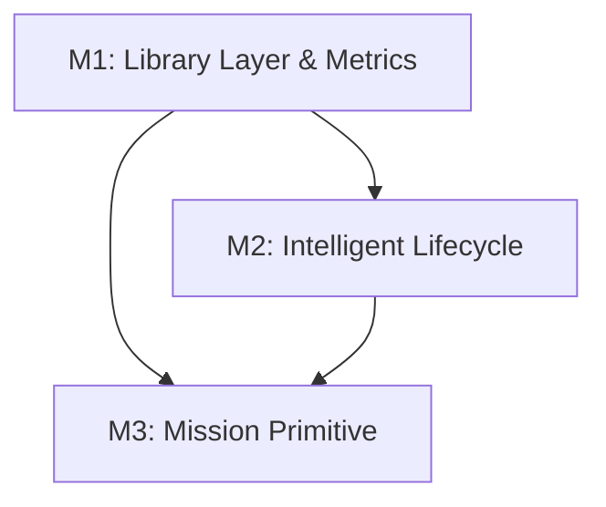

# dgov v0.9.0 Roadmap: The Mission-Oriented Governor

## 1. Version Strategy: v0.9.0 (Breaking/Major Architectural Shift)

I recommend skipping incremental 0.8.x releases and moving directly to **v0.9.0**.

### Rationale
The proposed changes fundamentally shift `dgov` from a **CLI-orchestrated tool** to a **programmatic library with a CLI wrapper**. Moving business logic out of `cli.py` and abstracting the `WorkerBackend` away from tmux are breaking changes for anyone currently extending the codebase, but necessary for the long-term vision of supporting Docker/SSH backends and autonomous "missions."

---

## 2. Milestone Breakdown

### Milestone 1: Core Decoupling & Observability
**Goal:** Extract business logic from the CLI and establish a foundation for data-driven governance.

- **Tasks:**
  - **Library Layer (L):** Move logic from `src/dgov/cli.py` into a new `src/dgov/api.py` or distribute into functional modules (`batch.py`, `panes.py`, etc.). `cli.py` should only handle argument parsing and JSON/Table formatting.
  - **Metrics Engine (M):** Create `src/dgov/metrics.py`. Implement aggregators for the SQLite event log.
    - *Deliverable:* `dgov stats` command showing success rate per agent, avg time-to-done, and failure heatmaps.
  - **Backend Protocol Purification (M):** Refactor `src/dgov/backend.py` to remove tmux-specific methods like `setup_pane_borders` from the core protocol. Move these to a `metadata` or `visual_style` extension.

- **Files Affected:**
  - `src/dgov/cli.py` (Refactor: 1615 lines → ~400 lines)
  - `src/dgov/backend.py` (Refactor: protocol cleanup)
  - `src/dgov/metrics.py` (New)
  - `src/dgov/persistence.py` (Update: add metrics helper views)

---

### Milestone 2: Intelligent Worker Lifecycle
**Goal:** Replace one-size-fits-all "done detection" with per-agent strategies and robust auto-rescue.

- **Tasks:**
  - **Strategy Injection (M):** Update `AgentDef` in `src/dgov/agents.py` to include `done_strategy` (e.g., `exit_code`, `commit_required`, `output_stabilization`) and `rescue_strategy`.
  - **Unified Waiter (M):** Refactor `src/dgov/waiter.py` to use these per-agent strategies.
  - **Automatic Rescue (M):** Implement `src/dgov/rescue.py` (or enhance `recovery.py`). If an agent is detected as "stalled" or "exited dirty," dgov should automatically:
    1. Capture recent logs.
    2. Commit uncommitted changes (already partially in `merger.py`).
    3. Signal "done" to trigger the next stage.

- **Files Affected:**
  - `src/dgov/agents.py` (Update: `AgentDef` schema)
  - `src/dgov/waiter.py` (Refactor: strategy-based polling)
  - `src/dgov/recovery.py` / `src/dgov/rescue.py` (Update/New: autonomous rescue logic)
  - `src/dgov/merger.py` (Refactor: extract auto-commit logic for reuse in rescue)

---

### Milestone 3: The Mission Primitive
**Goal:** Introduce a declarative "mission" that automates the full create → wait → review → merge loop.

- **Tasks:**
  - **Mission Spec (L):** Create `src/dgov/mission.py`. A Mission takes a task list (similar to Batch) but includes **Policies** (e.g., "Review all changes with Gemini," "Auto-merge on test pass," "Escalate to Claude on failure").
  - **The Governor Loop (L):** Implement a background loop (or a long-running foreground command) that manages the mission state until completion.

- **Files Affected:**
  - `src/dgov/mission.py` (New)
  - `src/dgov/batch.py` (Refactor: missions should likely replace/extend batch)
  - `src/dgov/persistence.py` (Update: mission state tracking)

---

## 3. Dependency Graph

*M1 is a hard block for M3 because the Mission needs a clean API to call, rather than shelling out to `dgov` CLI commands.*

---

## 4. Risk Assessment

| Risk | Impact | Mitigation |
|------|--------|------------|
| **CLI/API Split Complexity** | High | Use a "Side-by-Side" approach: implement `api.py` and migrate commands one-by-one, keeping tests passing at each step. |
| **Backend Abstraction** | Medium | Ensure `TmuxBackend` remains the default and fully functional. Test with a mock `DockerBackend` early. |
| **Rescue False Positives** | High | Ensure rescue is conservative. Never commit empty changes; always capture a "rescue checkpoint" before acting. |
| **Mission State Bloat** | Low | Missions should be stateless where possible, relying on the SQLite `events` and `panes` tables for recovery. |

---

## 5. What NOT to Do (Anti-Patterns)

1.  **Do NOT add a Daemon:** `dgov`'s strength is its "zero-daemon" architecture. The Governor Loop should be a process (potentially in a tmux pane) but not a persistent system service.
2.  **Do NOT implement Docker today:** Abstract the *protocol* so it's possible, but don't actually build the Docker backend yet. Focus on making the tmux implementation "clean" first.
3.  **Do NOT over-abstract the Mission:** Start with a few hardcoded policies (ReviewFix, AutoMerge) before building a generic DSL.

---

## 6. Closing Argument for v0.9.0
The current 0.8.0 architecture is a collection of powerful scripts. v0.9.0 turns it into an operating system for agents. By moving business logic out of the CLI and making the "Mission" a first-class citizen, `dgov` becomes capable of running 24/7 autonomous coding pipelines.
