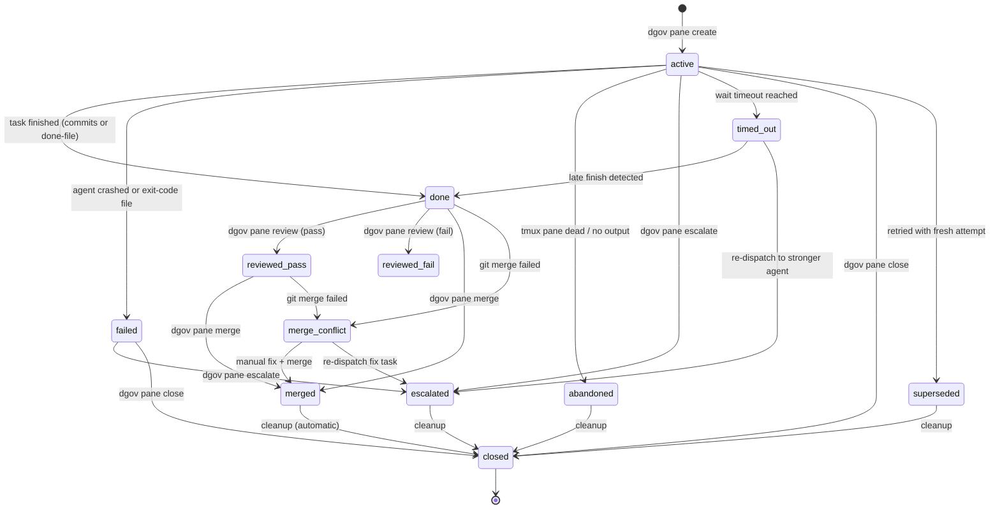

# Pane lifecycle

Managing worker panes is the primary function of the `dgov` CLI. This page documents every operation available under the `dgov pane` command group, including state machine transitions and recovery operations.

## State Machine

Panes follow a strict state machine enforced by the persistence layer. Transitions are validated to ensure consistency across the worker lifecycle.



Panels progress through a well-defined set of states:

| State | Description |
|-------|-------------|
| `active` | Pane is running, agent is processing tasks |
| `done` | Task completed successfully (signal file or new commits found) |
| `failed` | Task failed with error condition |
| `abandoned` | Task was explicitly abandoned by user or pane died without signal |
| `timed_out` | Pane exceeded max duration without progress |
| `closed` | Worktree and agent process have been removed (terminal state) |
| `escalated` | Task transferred to a stronger agent |
| `superseded` | Pane replaced by a newer attempt (e.g., after retry) |
| `merged` | Changes merged into main branch |
| `reviewed_pass` | Diff has been reviewed and passed validation |
| `reviewed_fail` | Diff has been reviewed and failed validation |
| `merge_conflict` | Git merge failed due to conflicts |

**Important**: Every state change for a worker pane is validated against the `VALID_TRANSITIONS` table in `persistence.py`. This ensures that a pane cannot move, for example, from `merged` back to `active`. Illegal transitions raise `IllegalTransitionError`. Use `dgov pane signal <slug> done` to override if needed.

## Create

Spawns a new worker by creating a git worktree, a tmux pane, and launching an agent with a prompt.

```bash
# Basic create
dgov pane create -a claude -p "Add retry logic to the HTTP client"

# With template and variables
dgov pane create -T bugfix --var file=src/foo.py --var description="off-by-one"

# Using auto-classification
dgov pane create -a auto -p "Refactor this module"
```

| Flag | Short | Type | Default | Description |
|------|-------|------|---------|-------------|
| `--agent` | `-a` | string | `None` | Agent CLI to launch (or `auto` to classify) |
| `--prompt` | `-p` | string | `None` | Task prompt for the agent |
| `--project-root`| `-r` | string | `.` | Project root |
| `--session-root`| `-S` | string | `None` | Location of `.dgov/`. Defaults to project root. |
| `--permission-mode`| `-m`| string | `acceptEdits` | Mode: `plan`, `acceptEdits`, `bypassPermissions` |
| `--slug` | `-s` | string | `None` | Override auto-generated slug |
| `--extra-flags` | `-f` | string | `""` | Extra flags for the agent CLI |
| `--env` | `-e` | string | `None` | Environment variable as `KEY=VALUE` (repeatable) |
| `--preflight` | | bool | `True` | Run pre-flight checks before dispatch |
| `--fix` | | bool | `True` | Auto-fix fixable preflight failures |
| `--max-retries` | | int | `None` | Override agent max auto-retries for this pane |
| `--template` | `-T` | string | `None` | Use a prompt template by name |
| `--var` | | string | `None` | Template variable as `key=value` (repeatable) |

## List

Shows all tracked worker panes with their live status.

```bash
dgov pane list
dgov pane list --json
```

**Output Fields:**
- `Slug`: unique task identifier.
- `Agent`: agent currently running the task.
- `State`: `active`, `done`, `merged`, etc.
- `Alive`: `✓` if the tmux pane/process exists.
- `Done`: `✓` if the task is finished (signal file or new commits found).
- `Freshness`: `fresh`, `warn`, or `stale` relative to `main`.
- `Duration`: total execution time.
- `Prompt`: first 40 characters of the prompt.

## Wait

Block the terminal until a worker completes.

```bash
# Block until done
dgov pane wait add-health-check

# With timeout and custom poll interval
dgov pane wait add-health-check -t 300 -i 5
```

| Flag | Short | Type | Default | Description |
|------|-------|------|---------|-------------|
| `--timeout` | `-t` | int | `600` | Max seconds to wait (0 = forever) |
| `--poll` | `-i` | int | `3` | Poll interval in seconds |
| `--stable` | `-s` | int | `15` | Seconds of stable output before declaring done |
| `--auto-retry` | | bool | `True` | Auto-retry failed panes per policy |

## Wait-all

Wait for all currently `active` panes to complete.

```bash
dgov pane wait-all --timeout 1200
```

## Review

Preview the changes in a worker's worktree before merging.

```bash
# Summary diff and safety verdict
dgov pane review add-health-check

# Complete diff text
dgov pane review add-health-check --full
```

## Diff

Lower-level git diff against the base commit.

```bash
dgov pane diff add-health-check --stat
dgov pane diff add-health-check --name-only
```

## Capture

Read live output from the agent's tmux pane.

```bash
dgov pane capture add-health-check -n 50
```

## Merge

Merge the worker's branch into `main`.

```bash
# Merge and close worktree (default)
dgov pane merge add-health-check

# Merge only, keep worktree open
dgov pane merge add-health-check --no-close

# Manual conflict resolution
dgov pane merge add-health-check --resolve manual
```

## Merge-all

Sequentially merge all panes that are in the `done` state.

```bash
dgov pane merge-all --resolve agent
```

## Escalate

Hand off a task from its current agent to a more capable one (e.g., `pi` -> `claude`).

```bash
dgov pane escalate fix-parser -a claude
```

## Retry

Re-dispatch a failed or timed-out task. Creates a new pane with a `-2` suffix and fresh worktree.

```bash
dgov pane retry fix-parser --close
```

## Retry-or-Escalate

Retry a failed pane, auto-escalating after N retries at the same tier.

```bash
dgov pane retry-or-escalate fix-parser --max-retries 2
```

## Resume

Re-launch an agent process in an existing worktree. Useful if the agent crashed or was manually killed. The worktree and all changes are preserved.

```bash
dgov pane resume fix-parser
```

## Logs

View the persistent log file for a specific worker pane.

```bash
dgov pane logs fix-parser --tail 50
```

## Output

Show clean worker output. Prefers live tmux capture for TUI agents, falls back to persistent log for dead panes.

```bash
dgov pane output fix-parser -n 50
```

## Close

Kill the agent process and remove its git worktree.

```bash
dgov pane close fix-parser
dgov pane close fix-parser --force # ignores dirty changes
```

## Prune

Cleanup stale database entries for panes that no longer have a running process or worktree.

```bash
dgov pane prune
```

## Classify

Recommend an agent for a specific prompt without creating a pane.

```bash
dgov pane classify "Add documentation to all functions in src/parser.py"
```

## Message and Respond

Interact with a running worker pane.

```bash
# Send text to stdin (backend-agnostic)
dgov pane message fix-parser "Proceed with the refactor"

# Send keystrokes directly (tmux specific)
dgov pane respond fix-parser "Enter"
```

## Nudge

Ask a worker if it is done and wait for a `YES/NO` response in the output.

```bash
dgov pane nudge fix-parser --wait 20
```

## Signal

Manually override the state of a pane.

```bash
dgov pane signal fix-parser done
dgov pane signal fix-parser failed
```

## Utility Panes

Launch standard CLI tools in dedicated panes without creating a git worktree or agent.

```bash
dgov pane util "tail -f /var/log/syslog" --title logs
dgov pane lazygit
dgov pane yazi
dgov pane htop
dgov pane k9s
dgov pane top
```
