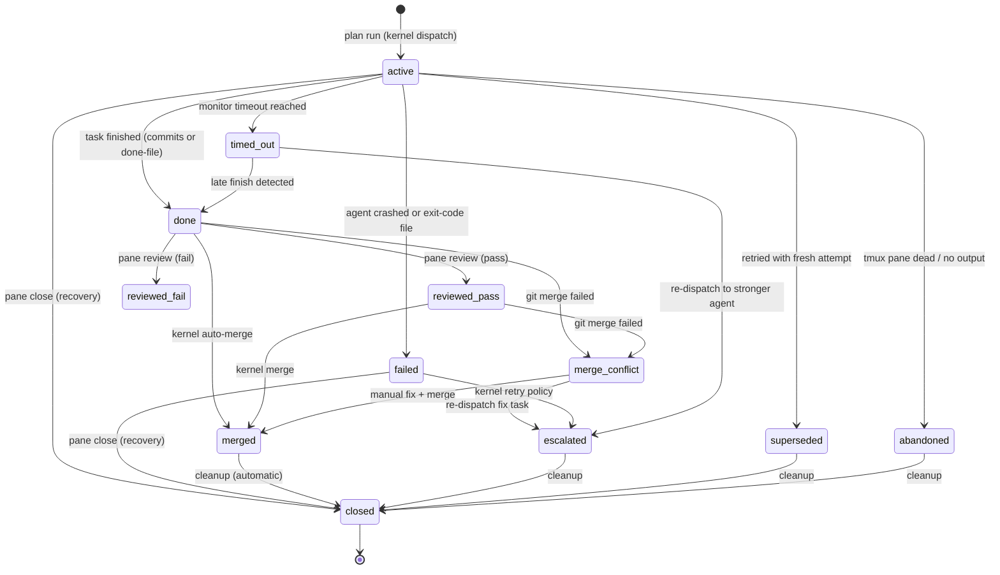

# Pane lifecycle

Pane commands are now primarily **read-only** and **recovery** operations. All implementation work flows through the plan system (`dgov plan run`). This page documents the available `dgov pane` command group operations for observation and recovery.

## State Machine

Panes follow a strict state machine enforced by the persistence layer. Transitions are validated to ensure consistency across the worker lifecycle. The kernel handles all lifecycle transitions automatically; pane commands are for observation and manual override only.



Panels progress through a well-defined set of states:

| State | Description |
|-------|-------------|
| `active` | Pane is running, agent is processing tasks |
| `done` | Task completed successfully (signal file or new commits found) |
| `failed` | Task failed with error condition |
| `abandoned` | Task was explicitly abandoned by user or pane died without signal |
| `timed_out` | Pane exceeded max duration without progress |
| `closed` | Worktree and agent process have been removed (terminal state) |
| `escalated` | Task transferred to a stronger agent |
| `superseded` | Pane replaced by a newer attempt (e.g., after retry) |
| `merged` | Changes merged into main branch |
| `reviewed_pass` | Diff has been reviewed and passed validation |
| `reviewed_fail` | Diff has been reviewed and failed validation |
| `merge_conflict` | Git merge failed due to conflicts |

**Important**: Every state change for a worker pane is validated against the `VALID_TRANSITIONS` table in `persistence.py`. This ensures that a pane cannot move, for example, from `merged` back to `active`. Illegal transitions raise `IllegalTransitionError`. Use `dgov pane signal <slug> done` to override if needed.

## Dispatch (via Plans)

Panes are now created exclusively through the plan system:

```bash
# Create and run a plan
dgov plan run .dgov/plans/my-task.toml
```

See [Plan System](plan-system.md) for full documentation on creating and running plans.

## List

Shows all tracked worker panes with their live status.

```bash
dgov pane list
dgov pane list --json
```

**Output Fields:**
- `Slug`: unique task identifier.
- `Agent`: agent currently running the task.
- `State`: `active`, `done`, `merged`, etc.
- `Alive`: `✓` if the tmux pane/process exists.
- `Done`: `✓` if the task is finished (signal file or new commits found).
- `Freshness`: `fresh`, `warn`, or `stale` relative to `main`.
- `Duration`: total execution time.
- `Prompt`: first 40 characters of the prompt.

## Review

Preview the changes in a worker's worktree before merging.

```bash
# Summary diff and safety verdict
dgov pane review add-health-check

# Complete diff text
dgov pane review add-health-check --full
```

## Diff

Lower-level git diff against the base commit.

```bash
dgov pane diff add-health-check --stat
dgov pane diff add-health-check --name-only
```

## Output

Show clean worker output. Prefers live tmux capture for TUI agents, falls back to persistent log for dead panes.

```bash
dgov pane output fix-parser -n 50
```

## Close

Kill the agent process and remove its git worktree. This is a recovery operation for stuck or unwanted panes.

```bash
dgov pane close fix-parser
dgov pane close fix-parser --force # ignores dirty changes
```

## Resume

Re-launch an agent process in an existing worktree. Useful if the agent crashed or was manually killed. The worktree and all changes are preserved.

```bash
dgov pane resume fix-parser
```

## Logs

View the persistent log file for a specific worker pane.

```bash
dgov pane logs fix-parser --tail 50
```

## Signal

Manually override the state of a pane. Used for recovery when automatic detection fails.

```bash
dgov pane signal fix-parser done
dgov pane signal fix-parser failed
```

## Utility Panes

Launch standard CLI tools in dedicated panes without creating a git worktree or agent.

```bash
dgov pane util "tail -f /var/log/syslog" --title logs
dgov pane lazygit
dgov pane yazi
dgov pane htop
dgov pane k9s
dgov pane top
```

## Recovery Summary

For stuck or failed panes:

```bash
# Check what's happening
dgov pane output <slug>
dgov pane diff <slug>

# Force a state transition
dgov pane signal <slug> done

# Kill and clean up
dgov pane close <slug>

# Rebuild state from events (if database is out of sync)
dgov pane recover -r .
```
